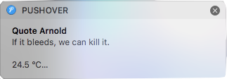

# Triggering IFTTT Webhooks

**In this example we shall see how to use mono to trigger a webhook on _IFTTT_. To demonstrate this, we create an application _Quote Arnold_ using Arduino SDK. This app will send random Schwarzenegger movie quotes to IFTTT.**

### Who should read this?

First I assume you are aware of IFTTT (If This Then That), and know how to setup *Applets* on their platform. You should also be familiar with Arduino IDE, and have installed the *OpenMono* board package using the *Board Manager*. It is (though not required), preferred if you know a good share of classic Arnold Schwarzenegger movies.

## Quote Arnold

Our goal is to create a Mono application that sends randomized Arnold Schwarzenegger movie quotes to IFTTT. On IFTTT we can forward them to the IFTTT app using push notification. Or you can choose to do something else with them.

Just because we can, we will also send the current temperature and battery level, along with the quote.

In my IFTTT applet I have chosen to forward the message to Pushover, so a can receive desktop push notifications:



## Setup

We will use Arduino IDE to implement our application. Of course we could also use a standard OpenMono SDK project, but I have choosen to demonstrate the use of Arduino IDE with OpenMono here.

To begin with, go ahead and open up Arduino IDE and create a new sketch.


Because Arduino only defines two C functions (`setup` & `loop`), all our resources must be declared in the global context. This means to must declare all ButtonViews, HttpClients and alike in the global context - not inside `setup`.

Also, because our application is driven by user input (UI button pushes), we will not use the `loop` function at all!

## Adding the push button

For starters we add the button that will trigger a quote being sent over HTTP to IFTTT.

First we include *OpenMono* classes and declare a pointer to a `ButtonView` instance:

```cpp
#include <mono.h>

using namespace mono::ui;
using namespace mono::geo;

ButtonView *button;
```

Inside the `setup` function will create the `ButtonView` object and position at the screen center:

```cpp
void setup() {
    button = new ButtonView(Rect(20, 80, 176 - 40, 65), "Quote Arnold");
    button->setClickCallback(&handleButton);
    button->show();
}
```