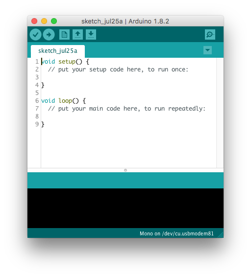

# Triggering IFTTT Webhooks

**In this example we shall see how to use mono to trigger a webhook on _IFTTT_. To demonstrate this, we create an application _Quote Arnold_ using Arduino SDK. This app will send random Schwarzenegger movie quotes to IFTTT.**

### Who should read this?

First I assume you are aware of IFTTT (If This Then That), and know how to setup *Applets* on their platform. You should also be familiar with Arduino IDE, and have installed the *OpenMono* board package using the *Board Manager*. It is (though not required), preferred if you know a good share of classic Arnold Schwarzenegger movies.

## Quote Arnold

Our goal is to create a Mono application that sends randomized Arnold Schwarzenegger movie quotes to IFTTT. On IFTTT we can forward them to the IFTTT app using push notification. Or you can choose to do something else with them.

Just because we can, we will also send the current temperature and battery level, along with the quote.

In my IFTTT applet I have chosen to forward the message to Pushover, so a can receive desktop push notifications:


## Setup

We will use Arduino IDE to implement our application. Of course we could also use a standard OpenMono SDK project, but I have choosen to demonstrate the use of Arduino IDE with OpenMono here.

To begin with, go ahead and open up Arduino IDE and create a new sketch.



Because Arduino only defines two C functions (`setup` & `loop`), all our resources must be declared in the global context. This means to must declare all ButtonViews, HttpClients and alike in the global context - not inside `setup`.

Also, because our application is driven by user input (UI button pushes), we will not use the `loop` function at all!

## Adding the push button

For starters we need to add the button that will trigger a quote being sent over HTTP to IFTTT.

First we include *OpenMono* classes and declare two pointers to a `ButtonView` and `TextLabelView` instances:

```cpp
#include <mono.h>           // include mono library

using namespace mono::ui;   // Add mono namespace
using namespace mono::geo;

ButtonView *button;         // create a ButtonView pointer
TextLabelView *statusLbl;   // a textlabel pointer
```

Inside the `setup` function will create (*construct*) the `ButtonView` and `TextLabelView` object and position them on the screen:

```cpp
void setup() {
    // Button
    button = new ButtonView(Rect(20, 80, 176 - 40, 65), "Quote Arnold");
    button->setClickCallback(&handleButton);
    button->show();

    // Text status label
    statusLbl = new TextLabelView(Rect(10,180,156,35), "Not connected");
    statusLbl->setAlignment(TextLabelView::ALIGN_CENTER);
    statusLbl->show();
}
```

We use the *new* syntax since we allocate the objects on the *stack*. This was why we created `button` and `statusLbl` as a pointer types.

We set the button click handler to a function called `handleButton`, which we will define in a moment. Lastly we tell the button to `show()` itself.

We also set the text alignment and content of the *TextLabelView*, before showing it.

Let's add a function for `handleButton` and then try out code:

```cpp
void handleButton()
{
    // we will add content later
}
```

Go ahead and compile and *upload* the code, and your should see a button and a text label on Mono's display.

## Starting Wifi

Before we can send any data to IFTTT, we need to connect to Wifi. Luckily in *SDK 1.7.3* we have a new *Wifi* class, that handles wifi initialization. Lets add that to our sketch, a pointer that we initialize in `setup()`:

```cpp
// button and text is declared here also
mono::io::Wifi *wifi;

void setup() {
    // Initialization of button and text left out here

    wifi = new mono::io::Wifi(YOUR_SSID, YOUR_PASSPHRASE);
    wifi->setConnectedCallback(&networkReady);
    wifi->setConnectErrorCallback(&networkError);
}
```

Notice that our Wifi object takes two callback functions, for handling the **wifi connected* and *connect error* events. Let's declare these two functions and let them change the `statusLbl` to reflect the state:

```cpp
void networkReady()
{
  printf("network ready!\r\n");
  statusLbl->setText("Connected");
}

void networkError()
{
  statusLbl->setText("Connect Error");
}
```

Now, we need to call `connect` on *Wifi* when the button is pushed.